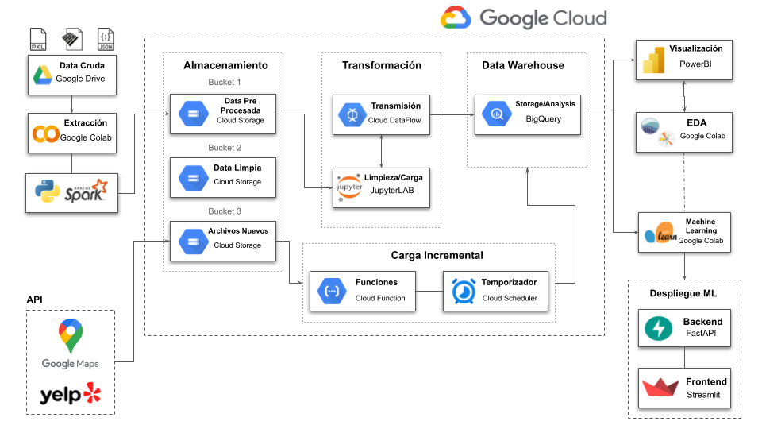

# ```Yelp & Google Maps - Reviews and Recommendations```

## Consultora SysTech-Solutions


## 👥​Cliente


Conglomerado de empresas destacado líder en el sector de restaurantes, con marcas reconocidas que operan tanto en Estados Unidos como a nivel internacional. La empresa ha construido una sólida reputación por ofrecer experiencias culinarias de alta calidad y servicios excepcionales. Su éxito continuo en un mercado altamente competitivo se debe a su enfoque en la innovación, la excelencia operativa y la satisfacción del cliente.

## ​​​💡​​Planteamiento del Proyecto

El sector de restaurantes en Estados Unidos es un mercado altamente competitivo y en constante evolución. Para mantenerse a la vanguardia de la industria, las empresas necesitan comprender y adaptarse a las preferencias y demandas cambiantes de los clientes. En este sentido, el análisis de la opinión de los usuarios en plataformas como **Yelp y Google Maps** se ha convertido en una valiosa herramienta para tomar decisiones estratégicas.

Estas plataformas de reseñas permiten a los usuarios compartir sus experiencias y opiniones sobre los negocios, ofreciendo una visión directa de la satisfacción del cliente y la calidad de los servicios ofrecidos. Sin embargo, el procesamiento y análisis de la gran cantidad de datos generados por las reseñas puede resultar un desafío para las empresas.

En este contexto, hemos sido contratados por un conglomerado de empresas del sector de restaurantes para llevar a cabo este análisis detallado del mercado estadounidense.

## 🎯​Objetivo

El objetivo principal de este proyecto es brindar a nuestro cliente un análisis exhaustivo de la opinión de los usuarios en Yelp y Google Maps sobre el sector de restaurantes. Utilizaremos técnicas avanzadas de análisis de sentimientos para lograr los siguientes objetivos:

- Predecir cuáles serán los rubros de los negocios que más crecerán (o decaerán).
- Ofrecer recomendaciones sobre la ubicación óptima para establecer nuevos locales basadas en datos demográficos, de mercado y en la información recopilada de las reseñas.
- Mejorar la satisfacción del cliente y fomentar la exploración de nuevos lugares y sabores a través del desarrollo de un sistema de recomendación personalizado.

## 📝​Alcance

- El análisis se enfocará en las reseñas de usuarios sobre restaurantes y negocios afines en los estados de Florida, California y Pennsylvania en el mercado estadounidense.
- Se considerarán únicamente las reseñas generadas a partir del año 2018 en adelante.
- Se utilizarán técnicas de análisis de sentimientos para comprender las opiniones y el sentimiento expresado por los usuarios en las reseñas.
- Se emplearán modelos de aprendizaje automático (machine learning) para predecir cambios en los negocios y desarrollar sistemas de recomendación.

## ​⚙️Procesos

- **Semana 1-2: Puesta en marcha el proyecto y trabajo con datos**
  - Se realizó un ETL-EDA Preliminar para identificar que tipo de datos se encuentran en los archivos proporcionados por el cliente y la calidad de los mismos.
  - Identificación de KPI's (Se detallan más adelante)
  - Se definió el Stack Tecnológico para los cuales se utilizaron principalmente los servicios de Google Cloud Platform.

  

  Los detalles se explican en 📁​[Semana 1-2](https://github.com/DanniRodrJ/GoogleMaps-Yelp/tree/main/Semana1-2)

- **Semana 3-4: Data Engineering**
  - Se almacenó toda la data en Cloud Storage.
  - Se realizó un ETL completo y a su vez se diseñó el modelo Entidad-Relación junto con un diccionario de datos.
  - Creación de un Data Warehouse en BigQuey
  - Automatización de los procesos a través de Cloud Function y Cloud Scheduler

  
  
  Los detalles se explican en 📁​[Semana 3-4](https://github.com/DanniRodrJ/GoogleMaps-Yelp/tree/main/Semana3-4)

- **Semana 5-6: Etapa de analytics y Machine Learning**
  - Se aplicó PowerBI para generar Dashboard y presentar el análisis, métricas y KPI's.
  - Preprocesamiento de los datos para análisis de Machine Learning
  - Se crearon modelos de Machine Learning
  - Despliegue del Sistema de Recomendación de restaurantes a través de Streamlit.

  

  Los detalles se explican en 📁​[Semana 5-6]()

## ✅KPIs

Antes de crear los dashboards interactivos en PowerBI, se llevaron a cabo una serie de análisis y visualizaciones a través de un EDA completo para detectar patrones y tendencias en las características únicas de los restaurantes. Además, se establecieron cinco indicadores clave de rendimiento (KPIs) para medir el progreso en términos de calidad, cantidad y naturaleza de los datos.

- **ISC (Índice de satisfacción del cliente)**: mide la satisfacción general de nuestros clientes a través de las reseñas en Yelp y Google. Se calcula tomando el promedio de las calificaciones en estas plataformas.
  - Objetivo: Aumentar 3% anual el promedio de calificaciones

- **REP (ratio de experiencias positivas)**: refleja la proporción de reseñas con calificaciones de 4 o 5 estrellas en relación con el total de reseñas. Nos permite medir el nivel general de satisfacción de nuestros clientes.
  - Objetivo: Aumentar 0.01 por trimestre

- **IOM (Índice de oportunidades de mejora)**: representa la proporción de reseñas con calificaciones de 1 o 2 estrellas en relación con el total de reseñas. Nos ayuda a identificar áreas específicas que necesitan atención.
  - Objetivo: Disminuir 0.01 por trimestre

Al final estos KPIs son empleados tanto para la plataforma de Yelp como la de Google Maps, resultando 6 en total.

## 🤖Machine Learning

Link del Producto [restaurant_recommendation_system](https://mainpy-bxwrzicy85lxappaf4n3vze.streamlit.app/)

## 💯​Resultados y conclusiones

Nuestro análisis proporcionó a nuestro cliente una visión integral del mercado estadounidense en el sector de restaurantes y negocios afines. Los insights obtenidos a partir de las opiniones de los usuarios en Yelp y Google Maps les ayudaron a comprender las preferencias y tendencias del mercado, identificar oportunidades de crecimiento y tomar decisiones estratégicas informadas.

Además, las recomendaciones sobre la ubicación de nuevos locales y el sistema de recomendación personalizado ofrecieron a los usuarios una experiencia mejorada y más personalizada, al tiempo que impulsaron el crecimiento y la fidelidad del cliente.

## ​🎬 Vídeo del proyecto

¡Te invitamos a ver nuestro video de presentación del proyecto! Puedes acceder a el a través de este enlace: [video]().

## ​🤝​Equipo desarrollador

Si deseas contactarnos o conocer más sobre nuestro trabajo, simplemente haz clic en cualquiera de nuestros nombres y serás redirigido a nuestros perfiles de LinkedIn. Estaremos encantados de responder a tus consultas y compartir más detalles sobre nuestras habilidades y experiencia.

<div align="center">
  
*Data Engineer-Data Science*
| [<br><sub>Danniela Rodríguez</sub>](https://www.linkedin.com/in/danniela-rodriguez-jove-/) | [<br><sub>Adrian Szklar</sub>](https://www.linkedin.com/in/adrian-szklar/) | [<br><sub>Nilda Perez</sub>](https://www.linkedin.com/in/nilda-perez-otero-74360192/) |
  | :---: | :---: | :---: |
  
*Data Analysis-Data Science*
| [<br><sub>Rodrigo Bogado</sub>](https://www.linkedin.com/in/rodrigo-bogado-a64b4925b/) | [<br><sub>Samuel Belapatiño</sub>](https://www.linkedin.com/in/samuel-sa%C3%BAl-belapati%C3%B1o-quiroz-915462264/) |
  | :---: | :---: |

<div align="left">

## 🙌​Actualizaciones y Agradecimiento

*¡Gracias por revisar este proyecto 🤗! Si deseas estar al tanto de futuras actualizaciones, te invito a marcar el repositorio con un estrella ⭐. Puedes encontrar la opción para hacerlo en la parte superior derecha de la página. Tu apoyo es muy apreciado.*
