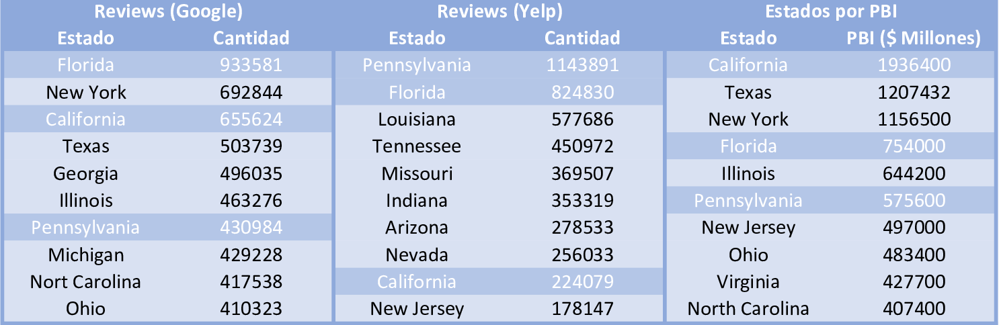

# ```Puesta en Marcha del Proyecto```

## 🗄️​Data Cruda

Fue proporcionada por el cliente a través de Google Drive y que a partir de ella usando Google Colab realizamos el análisis exploratorio preliminar.

La información proporcionada fue la siguiente:

- 📁 Google Maps: contenía 2 carpetas
  - ```reviews-estados``` con 51 subcarpetas correspondientes a cada estado, las cuales incluían de 3 a 20 archivos .json
  - ```metadata-sitios``` con 11 archivos .json

- 📁 Yelp: contenían 5 archivos (3 .json, 1 .pkl y 1 .parquet)

Para mayor comodidad concatenamos todos los archivos relacionados y para almacenar la menor cantidad de memoria posible fueron pasados todos los archivos a .parquet.

## 👀ETL-EDA Premilinar

Puedes acceder a los notebooks por medio de 📁[Eda Preliminar](https://github.com/DanniRodrJ/GoogleMaps-Yelp/tree/main/Semana1-2/EDA%20Preliminar)

Durante esta exploración, se establecieron los criterios necesarios y se definieron los alcances para el desarrollo del proyecto.

En primer lugar, se identificaron las columnas importantes que podrían ser útiles. Además, se realizaron algunas transformaciones para determinar los rubros clave. Los rubros seleccionados fueron los siguientes:

```Python
    target_categories = [
    'restaurant', 'coffee', 'rice', 'paan', 'ice cream',
    'tortilla', 'tofu', 'pie', 'soup',
    'cheese', 'cupcake', 'pasta', 'cookie', 'chocolate',
    'frozen yogurt', 'salad', 'cake', 'donut',
    'sandwich', 'chicken', 'pizza', 'burguer', 'hot dog']
```

Además, se llevó a cabo un análisis de las reseñas por estado en ambas plataformas, identificando los diez estados con mayor cantidad de reseñas. A su vez, se realizó una investigación sobre los diez estados con el mayor Producto Bruto Interno (PBI) hasta la fecha en los Estados Unidos. Como resultado, se seleccionaron los estados que estaban presentes en los tres listados principales, los cuales fueron California, Pennsylvania y Florida.



## 🧩​Stack Tecnológico

En un principio se tenía previsto el siguiente Stack basado en las tecnologías de Big Data en un entorno local.


Donde el almacenamiento centralizado iba a ocurrir aplicando tecnologías de Hadoop corriendo a través de Docker, mientras que el Data Warehouse iba a estar conformado por Hadoop Hive junto con la interfaz gráfica de Hue.

Sin embargo, al final se optó por migrar a la nube de Google Cloud Platform. Principalmente este cambio se debió a que podíamos simplificar la gestión y el mantenimiento de la infraestructura lo que nos permitió concentrarnos en el desarrollo del proyecto.

Utilizando finalmente el siguiente Stack, basado principalmente en Google Cloud Platform (GCP)


## 🛠️​Metodología Propuesta

En la realización del proyecto, se utilizó el [**diagrama de Gantt**](https://github.com/DanniRodrJ/GoogleMaps-Yelp/blob/main/Semana1-2/Diagrama%20de%20Gantt.pdf) como una herramienta clave para facilitar la planificación y seguimiento de las actividades. Este diagrama brindó una representación visual clara de las tareas, su secuencia y duración en el tiempo. Gracias a esto, pudimos organizar mejor el trabajo, asignar recursos de manera efectiva y coordinar las actividades entre los miembros del equipo.

Además, se llevaron a cabo **reuniones regularmente** para mantener la comunicación y evaluar el progreso del proyecto. Estas reuniones se programaron los días lunes, miércoles y viernes en horario de tarde-noche, con el propósito de determinar las tareas a desarrollar y abordar cualquier problema o desafío que surgiera durante el proceso. Se reservaron otros días para reuniones de emergencia, que se utilizaron para resolver problemas puntuales que surgieron durante el desarrollo del proyecto.

Por otro lado, se estableció un ritmo de **reuniones con el Product Owner** cada semana y media. Estas reuniones tenían como objetivo presentar el trabajo realizado hasta el momento y recibir feedback valioso de su parte. Esta interacción periódica permitió ajustar y mejorar continuamente el proyecto en función de las necesidades y expectativas del cliente.
