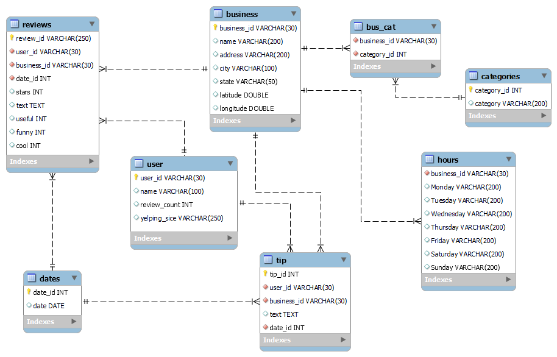

## 💾Data Lake

En la Plataforma de Google Cloud, se utilizó Cloud Storage en el cual se establecieron 4 buckets.

1. **Bucket** ```data_cruda```: donde se encuentra la data proporcionada por el cliente
2. **Bucket** ```data_limpia```: almacena toda la data limpia producto del proceso ETL completo sumado a la data nueva limpia que llegue
3. **Bucket** ```carga_incremental```: posee 2 carpetas:
   1. **data_historica**: posee 2 archivos (Google y Yelp), donde se tiene los id nuevos que se ha recibido tanto de Google como Yelp agregándole una columna a la data llamada ```fecha_actual```
   2. **Google**: se almacenan los archivos temporales con data nueva de Google (una vez agrega a BigQuery, los archivos son eliminados)
   3. **Yelp**: se almacenan los archivos temporales con data nueva de Yelp (una vez agrega a BigQuery, los archivos son eliminados)
4. **Bucket** ```data_extraccion```: el cual recibirá toda los archivos nuevos semanalmente.


## Modelo Entidad-Relación

- **Esquema relacional de Yelp**


- **Esquema relacional de Google**


## 🛢️​Data Warehouse

El Data Warehouse se creó a través de BigQuery, el cual recibe los archivos del bucket "carga_incremental" luego del proceso ETL retornando 2 schemas uno llamado "Tabla_Google" y otro "Tabla_Yelp". De los cuales cada uno de ellos está conformado por las distintas tablas expresadas en el modelo ER.

Por lo tanto, a través de estos schemas se puede extraer la información con consultas SQL, conectándose al cliente de Big Query.


## 💡⚙️ ETL automatizado con Cloud Functions y Cloud Scheduler

Para automatizar el proceso ETL cada vez que llegue data nueva al bucket "data_extraccion", se crearon dos funciones en Cloud Functions llamadas "etl-yelp" y "etl-google", las cuales se ejecutan una vez que son llamadas por Cloud Scheduler (actúa como temporizador) semanalmente.


Si desea reutilizar las funciones, considera las siguientes configuraciones (pueden variar dependiendo de tus requerimientos)

        - Environment: 2nd gen
        - Solo HTTP como trigger (Opción --> Require authentication Manage authorized users with Cloud IAM.)
        - Memory allocated 4 GiB
        - CPU 2
        - Timeout 200 seconds   


    Define the schedule
    - Nombre/Descripcion/Region
    - Frecuency (every 3 hours: "0 */3 * * *", every Monday at 9:00: "0 9 * * 1")
    - Timezone (ARG)

    Configure the execution
    - Target type (HTTP)
    - URL (de la funcion)
    - HTTP method ---> POST